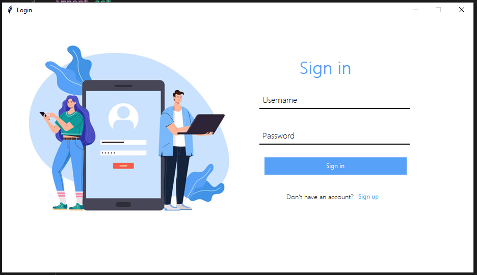

Here is a **professional and soft-toned `README.md`** for your Tkinter-based **Login & Signup GUI Project** with file-based authentication:

---

```markdown
# 🔐 Tkinter Login & Signup System

A simple and user-friendly desktop GUI application built using **Python's Tkinter**.  
This project provides an interactive login and signup interface with basic authentication using a local file-based system (`datasheet.txt`). Ideal for beginners exploring GUI development and user authentication mechanisms.

## 🚀 Features

- ✨ Beautiful GUI using Tkinter
- 🔐 Login and Signup functionality
- 🔁 Password confirmation for new users
- 📁 User data stored securely in a local text file
- 🛠 Error handling and validation messages
- 🖼️ Custom login and signup page design using images

## 🛠️ Technologies Used

- Python 🐍
- Tkinter (GUI)
- AST module (for safely evaluating stored data)
- Messagebox (for user-friendly alerts)

## 📦 How It Works

- Users can **register** with a unique username and password.
- Credentials are stored in a dictionary format in `datasheet.txt`.
- On login, credentials are matched and a new screen appears upon success.
- Basic input validations and error messages enhance usability.

## 🖥️ Screens

- ✅ Login Window  
- ➕ Signup Window  
- 🎉 Welcome Screen after successful login  

## 📸 Screenshots



## 📁 File Structure

```
project/
│
├── login.py           # Main script
├── login.png          # Login background image
├── datasheet.txt      # Stores usernames and passwords
```

## 📌 Note

- This project is for educational/demo purposes and does not use hashing or encryption. For production use, implement secure password hashing with libraries like `bcrypt` or `hashlib`.

## 🧑‍💻 Author

**Mian Arham Haroon**  
📌 [GitHub](https://github.com/mian-arham-haroon)  
🌐 [Portfolio](https://mian-arham-haroon.github.io/arham_portfolio)

---

Feel free to enhance and build upon it! 🚀
```

---

Let me know if you'd like me to generate badges, add setup instructions, or convert this into a `README.md` file directly.